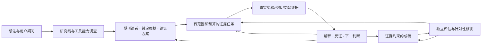

# ResearchFlow for Codex

**把多 agent 的执行力组织成可恢复、可论证、可写成论文的研究过程。**

ResearchFlow 协调选题调研、研究路线、期刊读者与论文论证、模拟/实验、机制分析、成稿和独立评估。它修复一种常见的执行失衡：agent 把局部精度、格式或资料搜集当成无限优化目标，而关键科研问题仍然没有回答。

它不是“放宽一切标准”。方程、单位、条件、原始证据、物理约束与校准/验证隔离仍是硬线；额外精度、检索深度和图文加工的投入由当前问题、证据差距和论文贡献决定。负面结果可以是成功的任务交付，同时推翻原假设。

## 组成与自动约束

| 层 | 具体文件/组件 | 职责 |
| --- | --- | --- |
| 自动入口 | `AGENTS.md` 中短的 ResearchFlow 区块 | 对完整科研任务调用治理 skill，声明多 agent 分工和返回条件 |
| 研究判断 | `skills/research-workflow-governor` | 演化问题、阶段、贡献、下一行动、证据解释和期刊读者 |
| 执行角色 | `templates/agents/rf_*.toml` | 文献、PaperSpine、证据、机制、独立评阅；按需启用，不固定开满 |
| 模拟组件 | 优化的 `simulation-project-orchestrator` | 可行工具、真实运行、按论断验证、无进展返回；保留专业参考和原有脚本 |
| 运行时 | Python 包 `researchflow` | 持久研究计划、任务契约、证据版本、预算、依赖、反证、交接处置和审计 |
| 写作接入 | `integrations/paperspine` | 对上游 PaperSpine 做可检查的文件交接与真实可用性诊断 |

AGENTS/skill/角色指令帮助模型主动遵循规则；运行时拒绝其入口内的非法状态转换。它没有拦截任意软件调用，也不自动判断物理真伪、期刊接受或因果关系。希望更强约束时，应把实际求解器/数据工具接到任务登记和审计入口，而不是只增加提示词。

## 安装

需要 Python 3.11+、可使用 subagent 的 Codex。运行时使用标准库。PaperSpine 与具体求解器分别安装，缺少它们不会伪造执行成功。

下载或克隆本仓库后，进入源码目录：

```powershell
cd research-workflow
python -m pip install -e .

# 当前桌面兼容布局：~/.codex/skills；已有模拟 skill 的授权更新
python scripts/install.py --update

# 或只装进一个已有科研项目（现代 .agents/skills 布局）
python scripts/install.py --project D:/my-research --update
```

安装器保留现有用户规则，只维护自己的标记区块；有生效的 `AGENTS.override.md` 时写到该文件。它安装两个 skill 和五份 `rf_` 角色配置，不修改模型、权限或 `config.toml`，不改 PaperSpine managed 文件。新建 Codex 运行后加载新指令。当前官方用户 skill 布局也可通过 `--skill-layout agents` 选择；在同一环境中只选一套布局，避免同名 skill 重复发现。

使用当前账户安装运行时时，可按 Python 环境需要加 `--user` 或使用虚拟环境。`--update` 会更新本仓库提供的 skill/角色内容；项目自己的原始研究数据、论文和第三方软件不在安装范围内。

## 实际使用

在科研项目里对 Codex 说：

> 使用 $research-workflow-governor。先读现有材料和我提出的疑问，建立一个可尝试的研究问题和候选期刊论证方案；用多 agent 分工开展最能改变判断的调查或计算，保留反证和限制，完成证据充分的论文草稿和独立评估。已授权项目内可逆的文件修改和实验运行。

协调者建立 `.researchflow/research-state.json`。文献和 PaperSpine 先参与问题/读者/论证；执行 agent 先给工具能力和 pilot，然后逐步验证、比较与分析。每次返回由请求者说明结果意味着什么。得到负面结果可以调整模型、问题、论断或目标期刊。

```powershell
python -m researchflow init ./study --question "哪个机制影响这个可测量的结果？"
python -m researchflow plan ./study ./plan.json
python -m researchflow task ./study ./contract.json
python -m researchflow context ./study --task pilot
# worker 只写自己的输出/result 文件；协调者串行登记
python -m researchflow record ./study pilot ./result.json
python -m researchflow decide ./study pilot ./decision.json
python -m researchflow audit ./study
```

具体字段和可跑样例见 [API.md](docs/API.md)。模型读取的 task packet 包含项目目的、当前问题/阶段、相关论断、输入、输出和预算；不反复装入所有文献和日志。`accept` 接收交付，论断提升需要另有证据与作用范围。

## 科研流程与效率原则



“两轮无进展”是默认返回协调者的条件，不是科研足够好的证明，也不是停止研究的命令。误差可能影响结论时继续做可区分的验证；结论已经稳定而下一次加密没有预期价值时，转向更重要的证据缺口。严肃错误只阻断它影响的论断和下游任务；无关的写作、资料提取或诊断可以继续。

参见 [设计判断](docs/design.md)、[模拟规则审计](docs/simulation-audit.md)、[PaperSpine 真实接入边界](docs/paperspine-integration.md) 和 [验证报告](docs/validation.md)。

## 验证与限制

```powershell
python -m unittest discover -s tests -v
python scripts/independent_check.py
python examples/steady_diffusion/run.py --project ./local-runs/diffusion
```

测试必须同时覆盖过度苛求和错误放行：预算/交接、反证与失效、陈旧输入、条件错误、物理/数据硬线、负面结果和任务恢复。前置/运行时测试通过不能证明模型永远不钻牛角尖；独立行为测试提供有限案例的观察。完整示例是一项明确标注的合成数值演示，不是新发现、实测材料验证或已被期刊接受的论文。

PaperSpine 是单独维护的 [上游项目](https://github.com/WUBING2023/PaperSpine)。文件交接、隔离服务测试和用户真实 profile 的可用性是不同层次，实际结论见接入报告。旧 `simulation-agent-mvp` 若硬编码全部治理 PASS，依然遵守它自己的程序限制；本工具不通过改提示词声称已经改变其代码。

Original code and maintained skills are released under MIT; dependency/source provenance is in [THIRD_PARTY.md](THIRD_PARTY.md).

发布助手为 `scripts/publish.ps1`。它先检查 GitHub 登录和干净的 Git 工作区，再创建/推送本工具仓库并回读仓库 URL。开发中的私有项目、`local-runs`、`.researchflow`、凭据和虚拟环境不包含在发布范围内。
