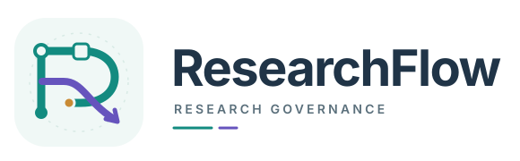
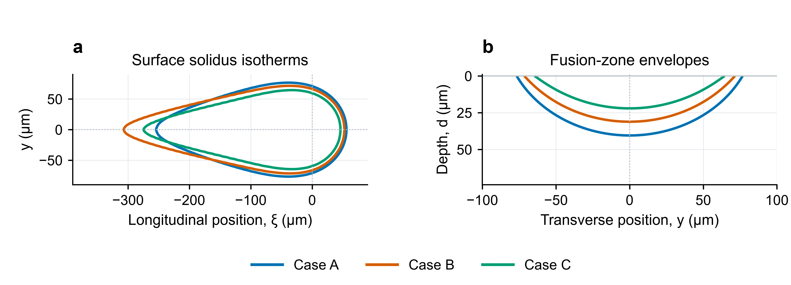
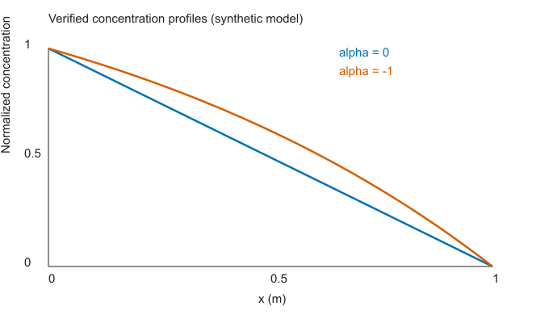

<p align="center">
  <picture>
    <source media="(prefers-color-scheme: dark)" srcset="docs/assets/logo-dark.svg">
    <source media="(prefers-color-scheme: light)" srcset="docs/assets/logo-light.svg">
    
  </picture>
</p>

<h3 align="center">围绕问题协作，沿着证据成稿。</h3>

<p align="center">把研究问题、专业任务、实际证据与论文主张，连成可追溯的多 Agent 研究流程。</p>

<p align="center">
  <a href="https://github.com/1187124906zty-commits/research-workflow/actions/runs/36809713217"></a>
  <a href="https://github.com/1187124906zty-commits/research-workflow/releases/tag/v0.1.0"></a>
  <a href="docs/compatibility.md"></a>
  <a href="LICENSE"></a>
  <a href="docs/COMMUNITY.md"></a>
</p>

<p align="center">
  <a href="#安装">安装</a> · <a href="#使用">使用</a> · <a href="#看看效果">案例与稿件</a> · <a href="docs/design.md">文档</a> · <a href="CONTRIBUTING.md">参与贡献</a> · <a href="#交流与反馈">交流群</a>
</p>

## ResearchFlow 是什么？

面向 Codex 的科研协作框架，以 skills 组织研究方法，以轻量 Python 运行时保存问题、任务、证据和判断。协调者维护整体研究路线，专业角色按需完成文献调查、证据生产、机制分析、论文写作与独立评阅。

- **每项任务都要回答一个研究问题。** 派发时说明输入、论断范围、输出、预算和返回条件。
- **结果要回到整体判断。** 接收交付与支持假设分别登记；负面结果、反证和尚未验证的解释继续保留。
- **论文沿着证据形成。** 证据版本、适用范围与待补验证进入写作交接，问题和论证可随新证据调整。

当前提供 **治理 skill、模拟编排 skill、五类专业角色、状态 CLI、PaperSpine 适配器与可审阅案例**。多 Agent 由宿主调度，领域角色判断科学意义；运行时检查协议与证据绑定。方法与边界见 [设计说明](docs/design.md)。

## 安装

需要 **Python ≥3.11**。克隆仓库或解压 [v0.1.0 源码包](https://github.com/1187124906zty-commits/research-workflow/releases/tag/v0.1.0)，安装状态运行时：

```powershell
git clone https://github.com/1187124906zty-commits/research-workflow.git
cd research-workflow
python -m pip install -e .
```

在支持本地 skills 与 subagents 的 Codex 中，再选择一种集成安装方式：

```powershell
# 用户范围：当前官方文档的 ~/.agents/skills 布局
python scripts/install.py --skill-layout agents

# 或项目范围：目标科研项目目录须已存在
python scripts/install.py --project D:/my-research
```

开发机桌面客户端使用的 `~/.codex/skills` 兼容布局可用 `python scripts/install.py` 安装。选择宿主实际发现的一种布局，完成后启动新的 Codex 运行。仅安装 Python 包不会自动安装 skills 与角色。

同名文件已存在时，安装器提示冲突；确需更新本项目文件时添加 `--update`，先保留自己的定制差异。目录规则、角色发现与完整兼容条件见 [依赖与兼容说明](docs/compatibility.md)。

## 使用

| 你想做什么 | 从这里开始 |
|---|---|
| 查看实际成果 | [AMMT IN625 研究稿](paper/ammt-study/manuscript.pdf)与[证据说明](paper/ammt-study/README.md) |
| 开始自己的研究 | 安装集成后，在 Codex 中提交问题、材料位置与可用工具 |
| 查看状态或接入工具 | [CLI 与状态协议](docs/API.md)，登记任务、结果、处置并执行审计 |
| 接入写作产品 | [PaperSpine 接入](docs/paperspine-integration.md)，先做文件交接，再核对实时接口 |

在 Codex 中可以这样开始：

```text
$research-workflow-governor
研究这个项目中的核心问题。已有论文、数据与代码都在项目目录中。
请先调查材料和工具能力，提出面向候选期刊读者的论证方案，
安排有限的证据任务，依据结果更新判断，交付稿件并进行独立评阅。
```

协调者通过运行时保存 `.researchflow/research-state.json`：

```powershell
python -m researchflow init ./study --question "哪个机制影响这个可测量的结果？"
python -m researchflow task ./study ./contract.json
python -m researchflow record ./study pilot ./result.json
python -m researchflow decide ./study pilot ./decision.json
python -m researchflow audit ./study
```

JSON 文件需按真实任务填写；完整字段、计划与上下文命令见 [API 文档](docs/API.md)。协调者单独写共享状态，工作角色写各自声明的产物；关键交接回读原始证据。

## 看看效果

**AMMT IN625 激光熔池：把已有计算证据组织成可审阅的研究稿。**

<p align="center">
  <a href="paper/ammt-study/manuscript.pdf">
    
  </a>
</p>

案例基于公开 AMMT 实验条件与既有三维传导、相变计算，讨论扫描工况和高温物性对熔池形貌及热历程的影响。本次协作用这些产物准备英文稿件、核对论断范围并开展评阅，保留数据来源、模型假设与比较条件。

**数值计算原由 [SimAgent](https://github.com/1187124906zty-commits/simulation-agent-research) 执行。** ResearchFlow 与 [MAF 重构版](https://github.com/1187124906zty-commits/research-assistant-maf) 用于稿件准备、补证协调与评阅。B 工况热成像平均长度参与有效热源功率系数标定，A/C 保留该系数用于公开实验数据下的比较；当前 R11 稿为20页、4幅科学图、9张表和38个引用身份，另提供21页的可编辑Word。R6补证增加三个匹配轴向精化解，后续修订改进章节衔接、术语定义与因素解释；执行范围和待证事项保留在案例中，稿件尚未经期刊同行评审。

[阅读稿件 PDF →](paper/ammt-study/manuscript.pdf) · [可编辑 Word →](paper/ammt-study/manuscript.docx) · [编辑 LaTeX 源文件 →](paper/ammt-study/manuscript.tex) · [查看来源与交付范围 →](paper/ammt-study/README.md)

R3 增加了[科学编辑与逐句来源审查](paper/ammt-study/revision-r3/README.md)，通用责任与交接见[论文审查模式](docs/manuscript-audit.md)。案例包同时提供[完整 LaTeX 源码压缩包](paper/ammt-study/submission-source.zip)、核实数据表、[早期研究线与引用职责](paper/ammt-study/revision-r2/literature/citation-map.md)、[期刊原文学习](paper/ammt-study/revision-r2/journal/journal-learning.md)、[章节交叉审阅](paper/ammt-study/revision-r2/exchange/cross-section-review.md)和[当前审查处置](paper/ammt-study/revision-r11/review/review-response.md)。MAF 的[原有限协作](https://github.com/1187124906zty-commits/research-assistant-maf/tree/codex/maf-reconstruction/examples/ammt-manuscript)与[R2 分章运行](https://github.com/1187124906zty-commits/research-assistant-maf/tree/codex/maf-reconstruction/examples/ammt-deep-revision)分别保留实际完成范围；R2 原生讨论返回超时由协调者接收真实候选，后续评阅另行执行。作者指南、第三方论文原件和完整人工评估包留在本地，通用角色与skills继续按跨研究主题的规则维护。

[R4 写作方法与案例评价](paper/ammt-study/revision-r4/README.md)将标题关系、摘要证据选择、引言文献综合、段落衔接和评阅路由转为通用章节技能。已实读 12 份机构/学者原始指导，来源与适用范围可追溯；MAF 的[技能分发说明](https://github.com/1187124906zty-commits/research-assistant-maf/blob/codex/maf-reconstruction/docs/writing-skills.zh.md)说明实际加载与反馈机制。原安装技能和原数值案例保留，新的写作资源发布在独立重构仓库。

[R5 研究对象与章节依赖](paper/ammt-study/revision-r5/README.md)进一步将具体前驱限制、物性外推定义、热像/金相比较及成对后部相界连为研究路线；补入 Duke/Purdue 的实读指导和实际章节互查。显式写作任务直接收到短对象与衔接方法，全文审查检查目录、段落及引言—结果—结论闭合。研究稿的改进与通用框架效能仍分别评价。

<details>
<summary><strong>再看一个可复跑的例子：扩散计算 → 证据登记 → 技术稿</strong></summary>



标准库示例执行保守一维稳态扩散、三对网格和解析参考核验，再登记结果、判断并生成技术稿。它是确定性合成示例，未执行实验、模型调用或实时 PaperSpine。

```powershell
python examples/steady_diffusion/run.py --project ./local-runs/new-diffusion
```

使用新的输出目录。[查看示例与保存产物 →](examples/steady_diffusion/README.md)

</details>

## 依赖与兼容

| 使用层次 | 条件与实际范围 |
|---|---|
| 状态运行时与 CLI | Python ≥3.11；无第三方运行时 Python 依赖；安装构建使用 `setuptools>=68` |
| Codex 多 Agent 协作 | 宿主须支持 `AGENTS.md`、本地 skills、subagents 和可用模型账户；角色发现随客户端版本核对 |
| PaperSpine | 文件导出用标准库；实时调用需独立安装上游。已核验 `0.4.0-alpha.3` / public schema `1.1` |
| 数值与实验研究 | 求解器、许可、数据、设备与科学计算环境由具体项目提供 |
| 已检查平台 | Windows / Linux × Python 3.11、3.13 CI；开发机 Python 3.12。macOS 尚未测试 |

本包不直接调用模型服务，也不要求独立 API key；模型访问由宿主管理。包版本为 **v0.1.0 预发布版**，当前分支持续维护；首次 release 源码包不自动包含后续案例与文档。完整范围见 [兼容说明](docs/compatibility.md)。

## 验证与贡献

已核实的 [核心 CI](https://github.com/1187124906zty-commits/research-workflow/actions/runs/36809713217) 四组环境通过，运行安装、标准测试与确定性扩散示例。本地记录包含 38 项标准测试、14 项独立检查及有限模型行为观察；详情见 [验证记录](docs/validation.md)。这些检查说明相应软件路径与示例行为，科研主张仍需对应领域证据。

```powershell
python -m unittest discover -s tests -v
python scripts/independent_check.py
```

欢迎贡献工具适配、研究案例、证据交接、文档与测试。可 [提交 Issue](https://github.com/1187124906zty-commits/research-workflow/issues/new) 或按 [贡献指南](CONTRIBUTING.md) 提交 Pull Request；描述具体问题、修改结果和实际验证范围。

## 交流与反馈

**QQ 交流群：基米绿豆 研习群 · 871287830**

<p align="center">
  <a href="docs/COMMUNITY.md"></a>
</p>

欢迎交流多 Agent 科研协作、证据与稿件衔接、使用问题和改进想法。需要跟踪的事项请同步到 Issue；二维码失效时可搜索群号。[社区说明 →](docs/COMMUNITY.md)

## 继续了解

[设计说明](docs/design.md) · [CLI 与状态协议](docs/API.md) · [依赖与兼容](docs/compatibility.md) · [PaperSpine 接入](docs/paperspine-integration.md) · [设计论文](paper/researchflow-design.zh.md) · [验证记录](docs/validation.md)

项目采用 [MIT 许可](LICENSE)。可选上游产品与案例材料遵循各自来源和分发范围，见 [第三方说明](THIRD_PARTY.md)；设计论文阐述方法与架构，不含科研效果实证。
