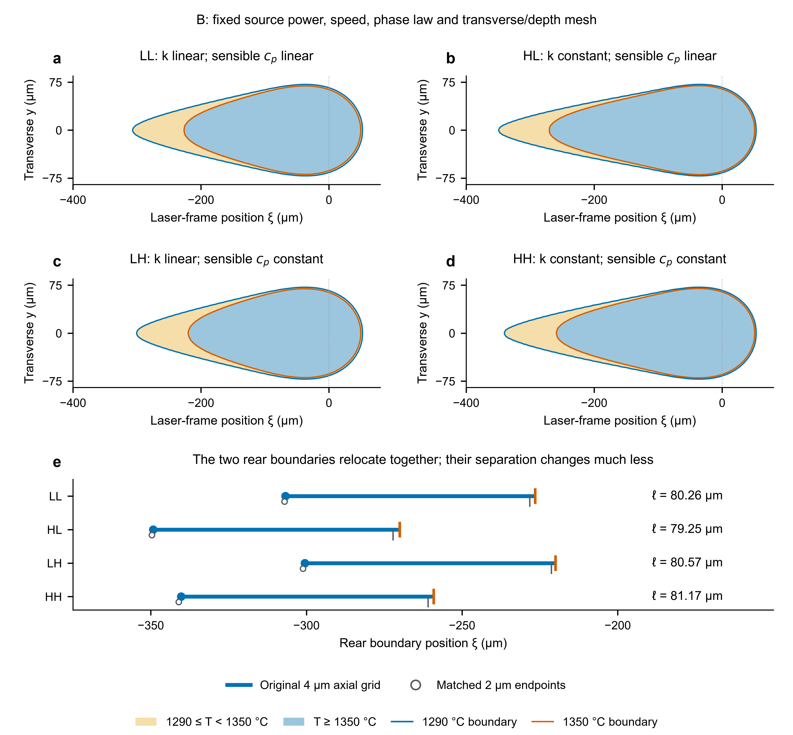

# AMMT IN625：从既有多 Agent 模拟到期刊研究初稿

[阅读当前英文稿 PDF](manuscript.pdf) · [可编辑 Word](manuscript.docx) · [编辑 LaTeX](manuscript.tex) · [R11方法表述与稳定名称](revision-r11/README.md) · [作者指南核对](revision-r11/journal/requirements.md) · [原R6来源索引](revision-r6/sources/citation-index.md)

需要完整源文件时，可下载 [扁平 LaTeX 源码包](submission-source.zip)，其中包含 TeX、当前 BibTeX、highlights、四幅实际使用的矢量图和复现说明。它是供修改与评阅的完整初稿包，投稿元数据仍待负责研究者补齐。

另附从同一已接受源码生成的可编辑 Word，正文、9张表和数学公式为原生可编辑内容，4幅图保留原始SVG与PNG兼容图像。Microsoft Word实际排版为21页，原PDF为20页，字体与部分换行、图表位置有所不同；引用与交叉引用编号保留为静态文字。独立转换审查已接受，具体编辑范围、核对依据与差异见[Word格式说明](revision-r11/word/delivery/format-report.md)。本次只增加编辑格式，研究文字、LaTeX/PDF与科学证据保持。

本案例围绕**几何标定与凝固热信息所需约束的关系**，整理为面向 *Additive Manufacturing* 读者的英文研究初稿。R6完成补证，R7改进分章写作，R8完整拆解用户指定的Xiong et al. (2022) JMPT论文并调整实际场图件。R9继续把范文的研究思路、科学矛盾收窄、条件因素分析与句群表达落实到同一手稿；[实际应用报告](revision-r9/integration/applied-writing-changes.md)给出原文动作、通用准则和正文落点。题目为 **Melt-pool geometry and rear phase boundaries in IN625 laser melting: sensitivity to high-temperature property extrapolation**。方法单独成章，结果与讨论合并，按照几何比较、物性依赖的热尾部、空间间隔与材料通过时间展开。

当前R11阅读稿为20页，摘要234词，4幅矢量主图、9张表和38个引用身份。R11先定义工况、物性方案、网格与观察量，再以简短稳定名称和具体谓词展开分析；方法正面交代函数接续及求解/观察的一致性，物性选择的证据要求在对应温度结果中讨论。[术语与科学范围](revision-r11/integration/terminology-and-scope.md)及[实际差异](revision-r11/integration/source-diff.md)记录修改。方程、表格数值、附录、实际图件、数值身份与科学未决项保持。公开仓库提供当前手稿、可编辑Word、源码包、复现说明和不含第三方原件的交付记录；作者指南原件、实际引用原件和完整人工评估资料继续只放本地资料包。

R10对照三篇原文的章节边界，明确引言的目标与路线、方法的实际设计与定义、结论的结果综合分别承担的工作，修订同一稿件的引言末段和方法入口；[实际章节交接](revision-r10/integration/chapter-handoff.md)保留该轮信息归属与双向核查。R11继承这一分工。

R9保留R8真实场显示，重写了文献成果如何导出当前设计，以及各项结果如何推进同一认识；局部输入变化与全场响应、后界共移与间距差分、空间与材料时间的关系分别解释。[论据充分性返修](revision-r9/integration/evidence-density-disposition.md)补出已有峰值对照、合并重复解释，并移出只支持未检验多层/控制前景的两条引用。当前沿用31个相关原文支持、5个仅摘要支持和2个实际软件身份；本地索引以当前PDF编号为准。通用规范按写作scope实际送入MAF加载器，并保留桌面执行与原生MAF批次的区别。历史R9资料保留在`human-review-r9`；以下R2–R8计数与运行叙述也保留历史身份。

数值研究原由 [SimAgent](https://github.com/1187124906zty-commits/simulation-agent-research) 完成；该链接保留项目定位，不保证匿名访问完整原始环境。本次 **ResearchFlow 任务治理 → 文献/期刊/证据专家 → PaperSpine 本地论证方法 → MAF 分章写作 → 章节交叉审阅 → 协调者整合 → 独立全文评阅** 从既有证据推进。R6独立审查发现核心后缘间距需要对应分支的精化证据，写作端主动启动真实独立模拟会话和多agent团队。补证已完成执行、原字段/观察器独立审查及领域处置后回信，写作端已接收并联动全文；[完整报告](revision-r6/simulation-supplement/complete-report.md)与[请求者解释](revision-r6/application/supplement-requester-disposition.md)分别记录证据和论文后果。PaperSpine 使用本地学术方法和实际文件适配器，未声称调用其在线产品或替用户点击配置。

R3 进一步执行 [科学编辑与逐句来源审查](revision-r3/README.md)，将方法和讨论各收拢为四个科学单元，移出库、agent 和求解器设置，补齐公式/参数/解释的直接来源与本地推导身份。当前引用数量反映本稿实际用途；历史 R2 的 39 项不作为本轮数量指标。复现信息见 [reproduction-notes.md](reproduction-notes.md)。

R4 将标题、摘要、引言和客观叙述的意见整理为[通用章节写作指南](revision-r4/guidance/section-guides.md)，依据[12 份实读机构/学者指导](revision-r4/guidance/source-ledger.json)，并在独立 MAF 仓库按任务范围分发。实际论文修订、前向应用、独立全文审查和修复记录见 [R4 交付说明](revision-r4/README.md)。它同时记录指南的有效部分和真实应用中的不足；七项技能不会自行认证文稿质量。

R5 将研究对象、句间关系和章节依赖落实到[通用指南与实际应用](revision-r5/README.md)：核对最近前驱的具体限制，专业定义末段割线线性外推与端值常数外推，明确热像/金相比较对象；方法—结果同责任，引言写作者与其互查，全文 reviewer 检查目录和段落主线。Duke/Purdue 等原始指导的来源与许可可追溯；MAF 显式写作任务直接收到短方法。已有结果、五图和五表继续保留，没有新 PDE 求解。

R6采用独立Methods责任人与合并Results and Discussion责任人的双向交接，再由独立整稿责任人检查证据和读者路线。实际41个引用身份含31个相关原文支持、8个摘要支持和2个实际软件身份；发现的近邻前驱明确限制了当前贡献范围。完整作者指南、合法取得的阅读原件与当前稿件组成**本地人工评估包**，R6新稿先供用户评阅，尚未推送。补证及其全文应用已验收；[最终整合复核](revision-r6/review/supplement-integrated-review.md)重算106个显示单元，无不符或新增必修项，[协调者处置](revision-r6/review/supplement-review-response.md)保留科学限制。当前PDF为23页、229词摘要、五幅矢量图和七张表，人工评阅/作者批准仍未取得。共享skill不含本案例的科学对象、材料、工况或量。

R2 原生 MAF 批次实际派发引言和讨论 writer；引言完成结构化返回，讨论产出章稿后在 1500 秒期限下中断。该批次的原生 reviewer/requester 未执行。协调者保留实际文件与超时记录，通过另行 Codex 专家交叉审阅和全文评阅推进稿件；[真实运行记录](revision-r2/native-drafts-record.md)与[MAF 诊断](https://github.com/1187124906zty-commits/research-assistant-maf/blob/codex/maf-reconstruction/examples/ammt-deep-revision/recovery/diagnosis.md)区分这些范围，未将部分运行报告为自动闭环。



## 稿件得到的结果

- B 工况拟合长度为 **359.16 μm**，但宽度为 **143.04 μm**、深度为 **31.12 μm**，NIST 100 μs 金相组平均宽深为 **123.5/36 μm**。长度拟合没有解决宽浅偏差。
- 原4×3×1 μm近源网格的固定 B 四角对照将联合长度响应分解为 **+43.21 − 6.17 − 2.76 = +34.28 μm**。同网格2×3×1 μm精化下，两个比热分支的导热率改变仍使后部固相线/液相线移动约 **40–44 μm**，对应配对轴向漂移小于 **0.486 μm**；大长度响应主要来自后缘移动。
- 原网格B/C后部相变跨度为 **80.26/80.79 μm**，材料通过时间为 **100.33/67.33 μs**。细网格相应为 **78.80/79.62 μm**、**98.50/66.35 μs**；时间缩短由 **32.895%** 变为 **32.642%**。空间相近不等于材料通过时间相同。
- 原六个生产解和拟合η保持不变；补证复用既有fine LL场，并新增HL/LH/HH三个精化解，求解耗时约 **65.74分钟**。表面图和Pe/通量诊断保留基准网格身份；当前附录的两张匹配比较表分别报告同网格精化量与配对漂移，图3另标出精化端点。
- 小间距响应仍需分情况：LH−LL幅值从 **0.307** 变为 **1.053 μm**；HH−LH细网格效应 **0.268 μm** 小于配对漂移 **0.331 μm**。两个网格名义符号相同不能认证连续极限方向或亚微米精度，导热率对间距的方向也随比热分支变化。

这些是当前传导/潜热模型内的结果。B 长度参与标定，A/C 为公开数据下的固定参数**非盲比较**。高温分支分别为按末段表格斜率线性外推与在表格端值处作常数外推两种数学定义，没有识别真实液相物性或 Marangoni 流。长度与宽深来自不同观测及轨迹群；NIST 当前宽深均值和 Lane 扩展不确定度来源分别说明。稿件尚未经期刊同行评审。

## 工具如何用于本次写作

| 环节 | 实际使用 | 可核查产物 |
|---|---|---|
| 科研治理 | ResearchFlow 状态运行时，登记任务、结果、协调者解释与论断范围 | [治理配方与交接](governance/) |
| 原始证据审查 | 专门 evidence Agent 读源码、数据、保存场和实验定义 | [证据审查](evidence/evidence-dossier.md)、[核实数据](evidence/verified-data.json) |
| 期刊与文献 | 两项专家任务追踪近邻至 2026-10-01，核实身份、阅读范围、对比条件与反证 | [研究线](revision-r2/literature/research-line.md)、[期刊学习](revision-r2/journal/journal-learning.md) |
| 建模与定量结果 | 专家只读原执行绑定、六个保存场、物性和观测代码；协调者采用方法/结果候选 | [R2 定量审查](revision-r2/methods-results/audit.md) |
| 分章与接口 | 实际 `agent-framework-core==1.19.0` writer 批次；另一专家审阅引言–方法–结果–讨论接口 | [原生返回状态](revision-r2/native-drafts-record.md)、[交叉审阅](revision-r2/exchange/cross-section-review.md) |
| 成稿与评阅 | 初次整稿复核后主动补证，再由独立责任角色检查最新稿件、106个数值单元和受影响页面 | [初次全文评阅](revision-r6/review/independent-review.md)、[最终补证整合复核](revision-r6/review/supplement-integrated-review.md)、[接收处置](revision-r6/review/supplement-review-response.md) |
| PDF 验证 | XeLaTeX/BibTeX 真实编译、页面渲染与图文检查 | [LaTeX](manuscript.tex)、[PDF](manuscript.pdf) |

软件协议审计检查交接和证据绑定，不判断科学真伪。原 R1 有已完成的有限 MAF evidence review；R2 native 写作批次中断，不能移用 R1 完成状态。R2 章节与实际全文另由专家读取，各检查范围分别说明。同模型不同上下文的审查不是统计独立的人类期刊同行评审。

## 期刊样式与当前限制

目标期刊是 *Additive Manufacturing*。采用Elsevier `elsarticle`的`preprint,12pt`与编号参考文献，组织Introduction–Methods–Results and Discussion–Conclusions，并提供[highlights](highlights.txt)。阅读版单栏正文宽180 mm、高245 mm，以保持矢量图标签可读；当前20页。此尺寸为阅读选择，出版社最终排版另行处理。

已经读取合法取得的目标期刊原文，并记录实际学习位置和版本。R2目标学习包含五篇final VoR及一篇corrected proof，其历史访问记录保留。R6获得用户提供的当日30页官方指南，关键条款已按原图核对；[当前指南说明](revision-r11/journal/requirements.md)区分官方规则、样本惯例与本稿选择。摘要234词，完整论文5,000–13,000词要求包括图注和参考文献，Word/iThenticate正式计数待作者确认。期刊全文、指南原件及OCR只放本地人工评估包。

提交前仍需负责研究者补齐作者/单位/通讯作者、贡献、经费与利益冲突声明，完成全文人工核查、规定工具的计数、标准术语核对及完整研究数据的存放安排。既有材料支持模型失配和有限物性函数比较，尚未建立新的算法、独立热历史验证或广泛物理机制；目标期刊所需贡献充分性须由研究者继续评估。

## 文件与重建

- `data/`：已有结果的原精度 CSV、材料表及紧凑 JSON；不是新实验数据。
- `figures/`：原始绘图生产的 PDF/SVG/PNG，来自记录数据和场；不使用生成图像替代数据。
- `evidence/`：冻结审查与只读核对配方；原始字段定位可能含开发机路径，请使用 SimAgent 对应案例路径映射。
- `governance/`：真实工具使用记录与源码；运行时状态本身保持本地，公开清理后的交接/审计。
- `literature/`：引用与阅读/要求记录；第三方全文、出版社模板包和浏览器页不发布。
- `review/`：实际独立评阅意见与协调者修订处置。

在此目录使用 TeX Live（或提供 `elsarticle`、`siunitx` 等包的等价 LaTeX 环境）：

```powershell
xelatex -interaction=nonstopmode -halt-on-error manuscript.tex
bibtex manuscript
xelatex -interaction=nonstopmode -halt-on-error manuscript.tex
xelatex -interaction=nonstopmode -halt-on-error manuscript.tex
```

LaTeX 源、当前 BibTeX 与四幅实际使用的矢量图完整保留。桌面内置编译器本次仍报告 `Unable to find standard directories for platform`；交付 PDF 使用本机已有 TeX Live 2026 编译。源文件仍可在内置编辑器修改，未创建替代编辑文档。

完整源码包独立解压重建与当前PDF的逐页文本、四幅使用图件核对见[R11重建记录](revision-r11/delivery/package-rebuild-check.json)。当前稿的[独立审查与处置](revision-r11/review/review-response.md)与原始数据核对分别记录，资料包仍待人工作者评阅。实际编译环境是现有Windows TeX Live 2026，不表示跨平台或全PDE重放已经验证。AI使用声明说明实际用途；人类监督与最终批准保持待确认。

此包没有重复发布原六个生产场、既有fine LL及新增三分支完整温度场、大型求解器环境或原始全部执行日志；不能仅凭紧凑表格重跑PDE。完整求解再现需要原案例的脚本、执行清单和所指字段。运行 [人工资料包builder](governance/build_human_review_r6.py) 会从当前源/PDF、引用记录和实际补证处置生成本地索引，排除initial-feedback等早期部分返回；其构建时状态见manifest。代码适用项目许可证；本稿与用户授权的案例图表为研究初稿材料，不授予第三方论文/实验图像的转载许可。
